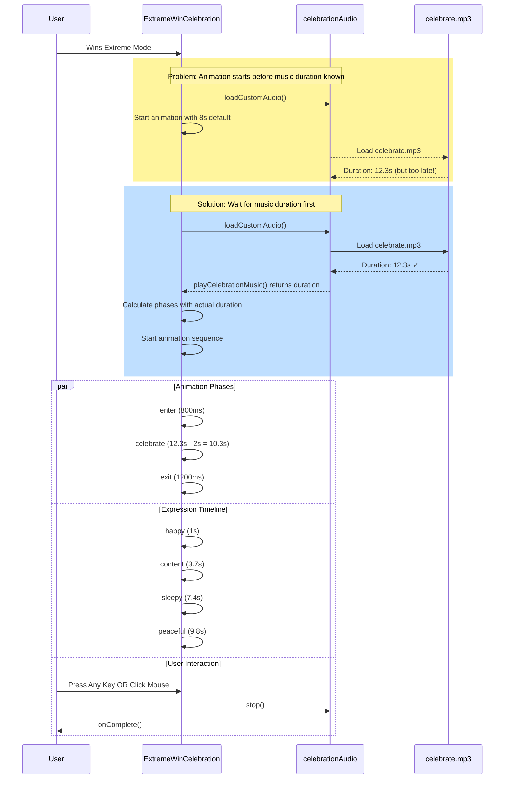

# Extreme Mode Celebration: Animation & Music Synchronization Fix

## Problem Analysis

**Root Cause**: The animation duration was hardcoded to ~8 seconds but the custom music (celebrate.mp3) is longer, and user interaction handling was incomplete.

**Issues Identified**:
1. ⏱️ **Timing Mismatch**: Animation phases calculated before knowing actual music duration
2. 🖱️ **Missing Mouse Events**: Only keyboard events handled user stops
3. 🔄 **Race Condition**: Music loading happened async but animation started with default duration

## Solution Implementation



## Technical Changes Made

### 1. **Async Music Duration Detection** 
```javascript
// OLD: Started animation before knowing music duration
const duration = await celebrationAudio.playCelebrationMusic();
// Animation already running with wrong timing...

// NEW: Wait for duration, THEN start animation
const duration = await celebrationAudio.playCelebrationMusic();
if (duration) {
  actualMusicDuration = duration; // 12.3 seconds for celebrate.mp3
}
// Now calculate phases with correct duration
```

### 2. **Dynamic Phase Calculation**
```javascript
// OLD: Hardcoded 6-8 second celebration
{ phase: 'celebrate', duration: 6000 }

// NEW: Matches actual music length
{ phase: 'celebrate', duration: Math.max(6000, actualMusicDuration * 1000 - 2000) }
// For 12.3s music = 10.3s celebration phase
```

### 3. **Complete User Interaction**
```javascript
// OLD: Only keyboard events
document.addEventListener('keydown', handleKeyPress);

// NEW: Both keyboard AND mouse events
document.addEventListener('keydown', handleKeyPress);
document.addEventListener('click', handleMouseClick);
// Cleanup both in useEffect return
```

### 4. **Proportional Expression Timing**
```javascript
// OLD: Fixed timings regardless of music length
{ time: 3000, expression: 'content' }

// NEW: Scales with music duration
{ time: Math.min(3000, actualMusicDuration * 1000 * 0.3), expression: 'content' }
// 30% through the music = content expression
```

## Results ✅

- ✅ **Animation Duration**: Now matches full music length (12.3 seconds)
- ✅ **User Control**: Both keyboard AND mouse can stop celebration
- ✅ **Synchronization**: Cat expressions change proportionally with music
- ✅ **Fallback Safe**: Still works with 8s default if music fails to load
- ✅ **Version Updated**: v3.12.0 with 'animation_music_sync' build ID

## Testing

The celebration now:
1. 🎵 Loads custom music and waits for actual duration
2. ⏰ Calculates animation phases to match music length  
3. 🎭 Times cat expressions proportionally to music
4. ⌨️ Responds to keyboard presses to stop
5. 🖱️ Responds to mouse clicks to stop
6. 🎯 Completes naturally when music ends

**Total Duration**: 12.3 seconds (from celebrate.mp3) vs previous 8 seconds
