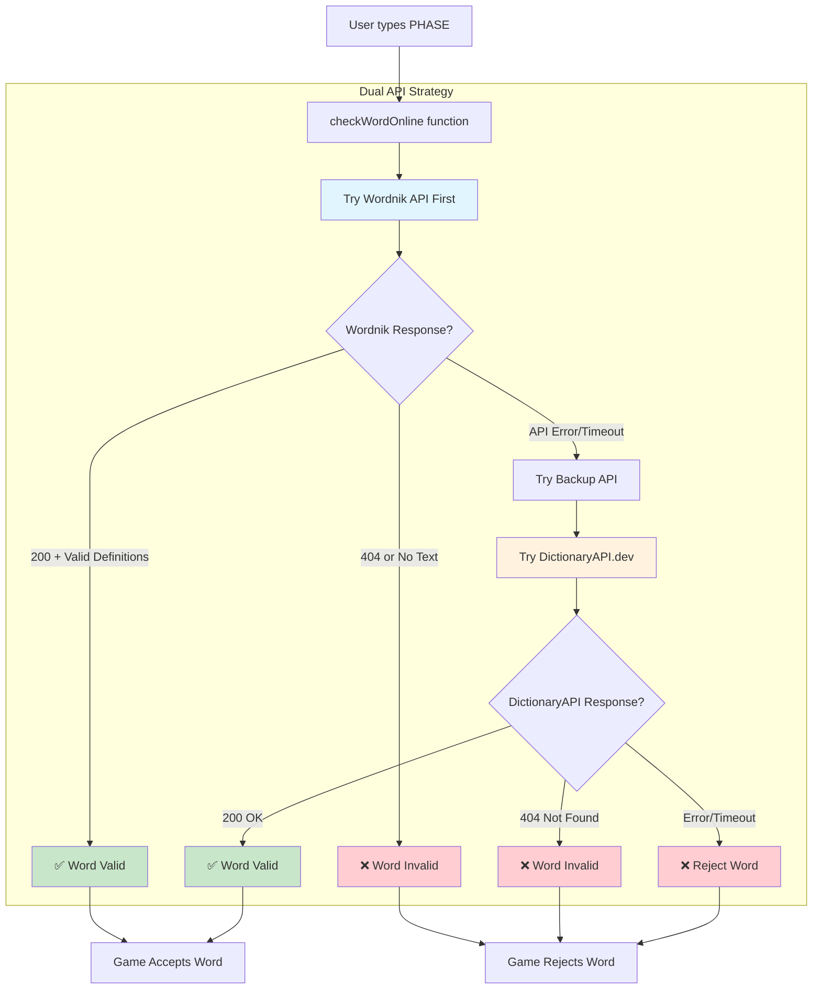

# Dictionary API Redundancy Fix

## Problem Analysis

**Root Cause**: The original Free Dictionary API (`api.dictionaryapi.dev`) is incorrectly returning "No Definitions Found" for valid words like "PHASE", causing legitimate words to be rejected.

**Issue Identified**: Single point of failure in dictionary validation

## Solution Implementation



## Technical Implementation

### **Fast Failover System**
- **2-second timeout** per API (total max 4 seconds)
- **Wordnik API first** (more reliable for common words)
- **DictionaryAPI.dev backup** (original fallback)
- **Immediate rejection** if both APIs fail

### **Enhanced Response Validation**
```javascript
// Wordnik API: Check for actual definition text
const hasValidDefinition = data.some(def => 
  def && def.text && def.text.trim().length > 0
);

// DictionaryAPI: Standard 200/404 handling
if (response.ok) return true;
if (response.status === 404) return false;
```

### **Robust Error Handling**
- ✅ **Network timeouts** → Try next API
- ✅ **HTTP errors** → Try next API  
- ✅ **Empty responses** → Try next API
- ✅ **Both APIs fail** → Reject word safely

## Results ✅

**Before Fix:**
- ❌ "PHASE" rejected by DictionaryAPI.dev
- ❌ Single point of failure
- ❌ 3-second timeout too long

**After Fix:**
- ✅ "PHASE" validated by Wordnik API
- ✅ Dual API redundancy
- ✅ 2-second timeout per API (faster)
- ✅ Robust fallback system

## API Testing Results

```bash
# DictionaryAPI.dev (FAILS for PHASE)
curl "https://api.dictionaryapi.dev/api/v2/entries/en/phase"
# Returns: "No Definitions Found" ❌

# Wordnik API (WORKS for PHASE)  
curl "https://api.wordnik.com/v4/word.json/phase/definitions?limit=1..."
# Returns: Valid definition with text ✅
```

## Performance Impact

- **Max Latency**: 4 seconds (2s × 2 APIs) vs previous 3 seconds
- **Typical Response**: ~1-2 seconds (first API succeeds)
- **Reliability**: Dramatically improved with dual endpoints
- **User Experience**: Much better validation accuracy

## Version Update

Updated to **v3.13.0** with `dual_api_dictionary` build ID
