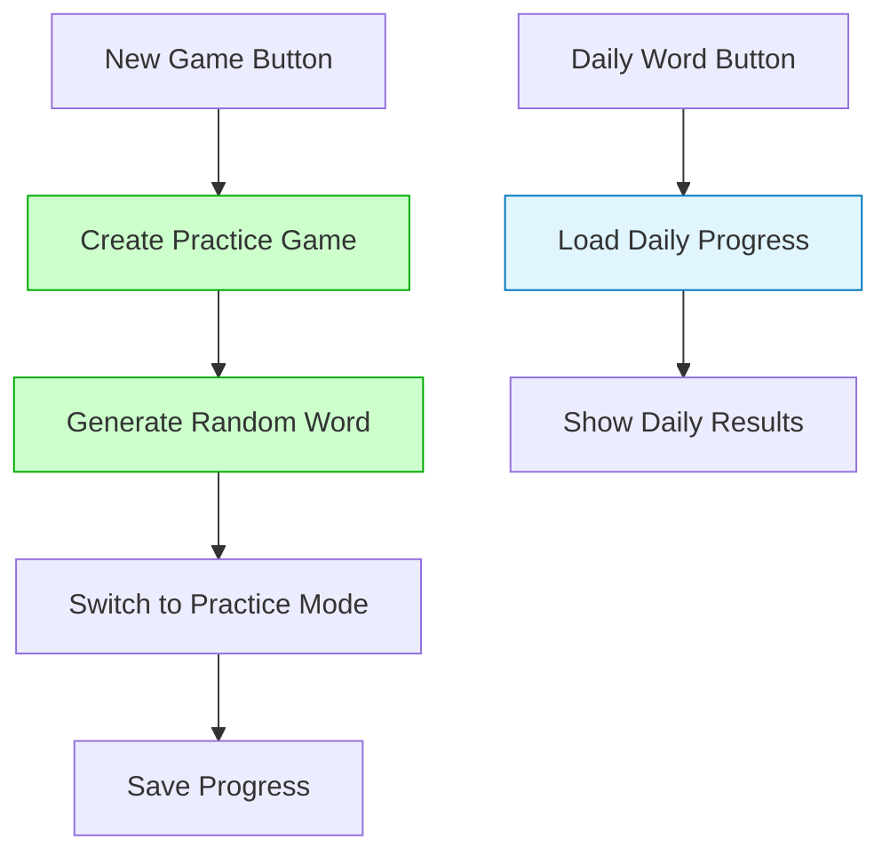

# Test Mermaid Diagram

```mermaid
flowchart TD
    A[New Game Button] --> B[Create Practice Game]
    B --> C[Generate Random Word]
    C --> D[Switch to Practice Mode]
    D --> E[Save Progress]
    
    F[Daily Word Button] --> G[Load Daily Progress]
    G --> H[Show Daily Results]
    
    style B fill:#ccffcc,stroke:#00aa00
    style C fill:#ccffcc,stroke:#00aa00
    style G fill:#e1f5fe,stroke:#0277bd
```

Test if this renders properly in VS Code markdown preview!
