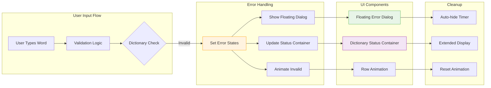

# Before vs After: UI Layout Comparison

```mermaid
flowchart TD
    subgraph "BEFORE: Poor Visibility"
        A1[User Types: ZZZZZ]
        A2[Dictionary Validation]
        A3{Invalid Word?}
        A4[Shows Error Message]
        A5[⚠️ Error Far Below Game Board]
        A6[❌ Poor User Experience]
        
        A1 --> A2 --> A3 -->|Yes| A4 --> A5 --> A6
        
        style A5 fill:#ffebee,stroke:#f44336,color:#000
        style A6 fill:#ffebee,stroke:#f44336,color:#000
    end
    
    subgraph "AFTER: Enhanced Visibility"
        B1[User Types: ZZZZZ]
        B2[Dictionary Validation]
        B3{Invalid Word?}
        B4[Shows Floating Error Dialog]
        B5[✨ Error Above Current Guess]
        B6[✅ Excellent User Experience]
        
        B1 --> B2 --> B3 -->|Yes| B4 --> B5 --> B6
        
        style B5 fill:#e8f5e8,stroke:#4caf50,color:#000
        style B6 fill:#e8f5e8,stroke:#4caf50,color:#000
    end
    
    subgraph "Key Improvements"
        C1[💡 Contextual Positioning]
        C2[🎯 Better Visual Attention]
        C3[📱 Mobile-Friendly Design]
        C4[⚡ Smooth Animations]
        C5[🔄 Maintains Existing Features]
        
        C1 --> C2 --> C3 --> C4 --> C5
        
        style C1 fill:#e3f2fd,stroke:#2196f3,color:#000
        style C2 fill:#e3f2fd,stroke:#2196f3,color:#000
        style C3 fill:#e3f2fd,stroke:#2196f3,color:#000
        style C4 fill:#e3f2fd,stroke:#2196f3,color:#000
        style C5 fill:#e3f2fd,stroke:#2196f3,color:#000
    end
```



## Implementation Details

### Visual Layout Comparison

#### Before Enhancement:
```
┌─────────────────────────┐
│     Wordle Game         │
├─────────────────────────┤
│  [G] [U] [E] [S] [S]   │ ← Current guess row
│  [ ] [ ] [ ] [ ] [ ]   │
│  [ ] [ ] [ ] [ ] [ ]   │
│  [ ] [ ] [ ] [ ] [ ]   │
├─────────────────────────┤
│ Dictionary Status:      │ ← Error message here
│ "GUESS not found"       │   (far from context)
├─────────────────────────┤
│   [Q][W][E][R][T]...   │
└─────────────────────────┘
```

#### After Enhancement:
```
┌─────────────────────────┐
│     Wordle Game         │
├─────────────────────────┤
│  ┌─────────────────┐   │ ← Floating error dialog
│  │ "GUESS not found"│   │   (above current guess)
│  └─────────▲───────┘   │
│  [G] [U] [E] [S] [S]   │ ← Current guess row
│  [ ] [ ] [ ] [ ] [ ]   │
│  [ ] [ ] [ ] [ ] [ ]   │
│  [ ] [ ] [ ] [ ] [ ]   │
├─────────────────────────┤
│ Dictionary Status:      │ ← Also shows here
│ "GUESS not found"       │   (for reference)
├─────────────────────────┤
│   [Q][W][E][R][T]...   │
└─────────────────────────┘
```

### Technical Architecture

